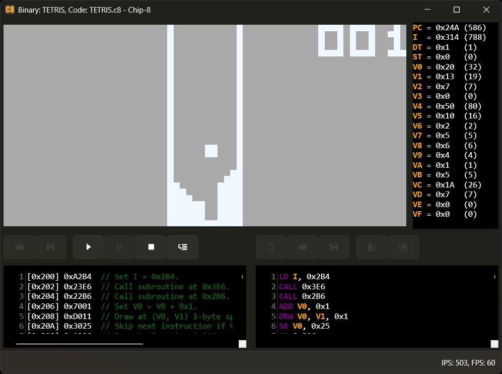
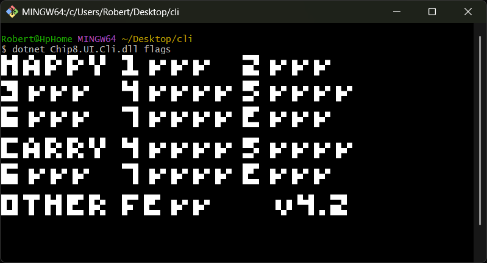
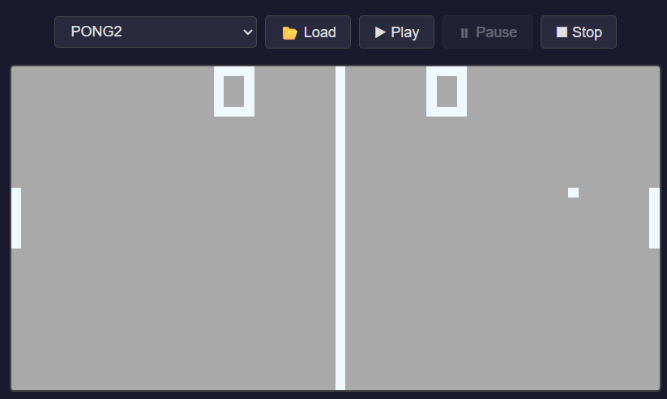

# CHIP-8

[](https://github.com/kurtanr/Chip8/actions/workflows/ci.yml)
[](https://codecov.io/gh/kurtanr/Chip8)
[](https://app.codacy.com/gh/kurtanr/Chip8)
[](https://github.com/kurtanr/Chip8/blob/master/LICENSE)

## Introduction

This repository contains [yet another](https://github.com/topics/chip8) implementation of a CHIP-8 emulator.

CHIP-8 is an [interpreted programming language](https://en.wikipedia.org/wiki/Interpreted_language) created in the mid-1970s. It was designed to allow video games to be more easily programmed for early 8-bit microcomputers. Systems running CHIP-8 are great candidates for emulation because of their simple architecture.

How this implementation differs from others:
* **Not just a weekend hackathon project:** Effort was put into code quality.
  * **Separation of concerns:** Each CPU instruction is implemented separately and is well-documented.
  * **Modularity & portability:** Core parts of the emulator (instructions, instruction executor) are decoupled, allowing different display, keyboard, and sound implementations to be easily injected.
  * **Automated pipeline:** Includes quality gates with [Codecov](https://about.codecov.io/) and [Codacy](https://www.codacy.com/) integration.
  * **Comprehensive testing:** High unit test coverage.
* Core parts of the emulator available as a [NuGet package](https://www.nuget.org/packages/Chip8), with executables available as WPF / CLI / web application
* The emulator passes all tests in the [CHIP-8 test suite by Timendus](https://github.com/Timendus/chip8-test-suite)
* The WPF user interface acts as a debugger, enabling:
  * Pausing / resuming and executing games one instruction at a time
  * Inspection of registers
  * Converting CHIP-8 binary to mnemonic code and vice-versa
  * Setting breakpoints (TODO: planned)

## Screenshots of UI implementations

### WPF (Debugger)
The WPF application provides a full debugging environment. You can inspect registers, view the disassembled code, and execute instructions step-by-step.



### CLI
A lightweight console application for running ROMs directly from your terminal.



### Web (Blazor WASM)
The emulator running directly in your browser using Blazor WebAssembly.



## TL;DR I want to play some TETRIS / PONG / BRIX ...

An emulator embedded in a Blazor WASM project is available here: https://kurtanr.github.io/Chip8/

WPF & CLI binaries are available on the [releases page](https://github.com/kurtanr/Chip8/releases).

When trying out the games, take note of the original CHIP-8 keyboard layout and how it is emulated:
```
Original layout:         Emulated with:
    1 2 3 C                 1 2 3 4
    4 5 6 D        -->      Q W E R
    7 8 9 E                 A S D F
    A 0 B F                 Z X C V
```

## CHIP-8 specification

-   Memory / CPU
    -   4096 bytes of addressable memory
    -   Sixteen 8-bit data registers (V0-VF)
    -   One 16 bit address register (I)
-   Graphics
    -   Monochrome display with a resolution of 64x32 pixels
-   Input
    -   16-key hexadecimal keypad

## Project goals

To provide:

-   A CHIP-8 interpreter capable of executing CHIP-8 programs
-   A disassembler able to show details about the CHIP-8 program
-   A user interface capable of loading and running CHIP-8 programs
-   An opportunity to have fun and learn something along the way

## References

-   [Wikipedia CHIP-8 article](https://en.wikipedia.org/wiki/CHIP-8)
-   [Cowgod's Chip-8 Technical Reference v1.0](http://devernay.free.fr/hacks/chip8/C8TECH10.HTM)
-   [CHIP-8 test suite by Timendus](https://github.com/Timendus/chip8-test-suite)
-   [CHIP-8 ROMs that are in the public domain](https://archive.org/details/Chip-8RomsThatAreInThePublicDomain)
