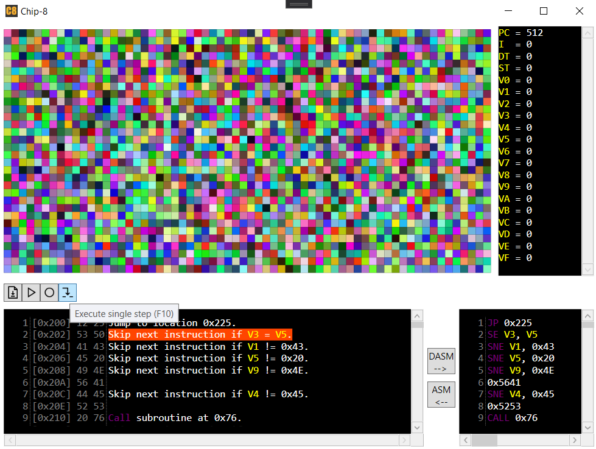

# CHIP-8

[](https://github.com/kurtanr/Chip8/actions/workflows/dotnet.yml)
[](https://codecov.io/gh/kurtanr/Chip8)
[](https://app.codacy.com/gh/kurtanr/Chip8)
[](https://github.com/kurtanr/Chip8/blob/master/LICENSE)

## Introduction

CHIP-8 is an [interpreted programming language](https://en.wikipedia.org/wiki/Interpreted_language) created in the mid-1970s. It was made to allow video games to be more easily programmed for the early 8-bit microcomputers.

Systems running CHIP-8 are great candidates for emulation, because of their simple architecture. CHIP-8 specification requires:

-   Memory / CPU
    -   4096 bytes of addressable memory
    -   Sixteen 8-bit data registers (V0-VF)
    -   One 16 bit address register (I)
-   Graphics
    -   Monochrome display with a resolution of 64x32 pixels
-   Input
    -   16-key hexadecimal keypad
        ```
        Original layout:         Emulated with:
            1 2 3 C                 1 2 3 4
            4 5 6 D        -->      Q W E R
            7 8 9 E                 A S D F
            A 0 B F                 Z X C V
        ```

## Project goals

To provide:

-   CHIP-8 interpreter capable of executing CHIP-8 programs
-   Disassembler able to show details about the CHIP-8 program
-   User interface capable of loading and running CHIP-8 programs

## UI Preview

<p align="left">
    
</p>

## References

-   [Wikipedia CHIP-8 article](https://en.wikipedia.org/wiki/CHIP-8)
-   [Cowgod's Chip-8 Technical Reference v1.0](http://devernay.free.fr/hacks/chip8/C8TECH10.HTM)
-   [Tips on writing disassembler and emulator](http://www.emulator101.com/introduction-to-chip-8.html)
-   [CHIP-8 ROMs that are in the public domain](https://archive.org/details/Chip-8RomsThatAreInThePublicDomain)
